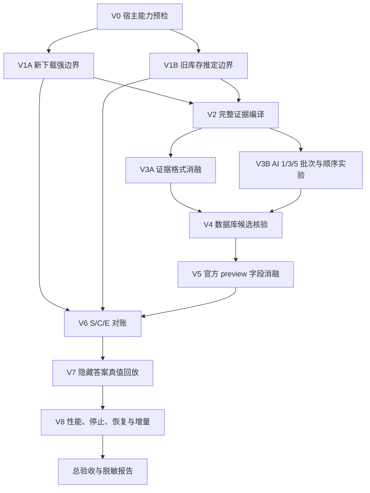

# MediaGovernor 单次安装验证插件：完整设计与实施边界

> 日期：2026-09-09
> 性质：验证系统设计，不是 MediaGovernor 正式产品的新版本说明
> 本轮边界：只落设计与证据，不创建插件、不修改 NAS、不调用模型、不发布版本

## 一句话决定

下一步不再给正式 `MediaGovernor` 打补丁，而是在同一个第三方插件仓中建立一个**独立、临时、只读的验证插件** `MediaGovernorValidator`。它一次安装就带齐采集、证据编译、AI 实验、数据库候选核验、官方 preview、S/C/E 对账、真值回放、性能与恢复性验证；用户只需启动一次完整验证，插件按依赖关系自动跑完并生成一份总报告。

验证插件不整理、不删除、不移动、不建硬链接。它的任务不是成为第二个产品，而是先证明正式产品赖以成立的每一条链路。全部硬门通过后，稳定合同和测试样本再移植回 `MediaGovernor`，验证插件随后退役。

## 1. 用户这次补充改变了什么

此前 P0-A 把“旧历史几乎没有 `download_hash`、当前下载器只剩一个任务”视为整个下载项边界方案的重大阻断。现在已知：当前 qBittorrent 是新下载器，大量旧任务本来就不会存在，旧记录还可能被删除。这不是产品异常，也不值得为了恢复过去而继续堆复杂逻辑。

因此，P0-A 应拆成两条不同年代的输入链：

### 1.1 从现在起的新下载

- 下载器里的一个任务是强输入边界；
- 通过 MoviePilot 的 `DownloadChain.list_torrents()` 取得任务；
- 通过 `torrent_files(hash, downloader)` 取得该任务的完整文件列表；
- torrent 可能包含一部或多部作品，所以它只是完整材料边界，不是作品结论；
- 正式产品未来应在任务仍存在时保存匿名任务指纹与完整文件清单。即使用户以后删除下载任务，已经观察到的边界也不会再次丢失。

这条链的验收要求是强约束：下载器返回的任务和文件必须完整进入证据，不能用 MoviePilot 的“正在下载”页面接口替代全任务枚举，也不能只取代表文件。

### 1.2 旧库存

- 不再试图凭零散历史恢复已经丢失的 torrent；
- 下载根下一个顶层文件或顶层目录作为“推定边界”；
- AI 可以在这棵完整当前目录树内部拆成一部或多部作品；
- 平铺散文件、跨目录附件、重复覆盖或读取不完整时标记“边界未知”；
- 推定边界和未知边界不能被升级成 torrent 事实，也不能自动进入修复。

旧历史仍有价值，但只用于挂接“某个源文件过去被整理到了哪里”，不再承担划分下载包或确认作品身份的职责。

## 2. 为什么选独立验证插件，而不是继续更新正式插件

继续在正式插件里边验证边改，会把三件事混在一起：未知接口是否可用、算法是否正确、用户界面是否可用。过去多轮失败的共同模式正是上一项还没有被证明，下一项就已经按假设实现，错误一路传播到最终结果。

独立验证插件有五个直接好处：

1. **一次安装收集全部答案。** 所有探针、实验变体、评价器和导出能力在同一个冻结 SHA 中，不再“验证一项、发布一版”。
2. **与正式产品隔离。** 验证失败不会继续污染 `MediaGovernor` 的对象模型、数据库和按钮语义。
3. **天然只读。** 插件根本不实现整理、重建、删除、移动或硬链接入口，即使判断错也不会碰媒体。
4. **能证明因果。** 每一阶段保存输入、输出、版本和耗时；最终错误可以定位到“没读全、压缩丢证据、AI 拆错、候选错、preview 错或对账错”。
5. **可以退役。** 它不是长期的第二个媒体治理入口。验证完成后，只有通过的合同、Schema、阈值和脱敏 fixture 进入正式插件。

新插件暂定：

- 插件 ID：`MediaGovernorValidator`
- 展示名：`媒体治理验证台`
- 源码目录：`plugins.v3/mediagovernorvalidator/`
- 测试目录：`tests/v3/mediagovernorvalidator/`
- 初始版本：`0.1.0`
- 默认状态：安装后停用；用户启用并主动点击后才读现场或调用 AI
- 权限：只读目录、下载任务、整理历史、媒体数据库查询和 `preview=true`
- 禁止能力：整理、重建、删除、移动、改名、硬链接、修改下载器或宿主配置

`MediaGovernorValidator` 是一次验证活动的工具，不改变“正式产品只有 MediaGovernor”这一产品边界。

## 3. 一次安装到底怎样把全部验证跑完

“全部放进一个插件”不等于所有步骤同时开始。有些步骤的输出是下一步的输入，强行并行只会让错误失去来源。正确做法是一个插件内置一张固定的执行图：必须串行的自动串行，互不依赖的实验在限流下并行，任何阶段失败都保存现场并继续执行仍有诊断价值的分支。



### 3.1 V0：宿主能力预检

目的：先回答“这个宿主到底允许插件调用什么”，不让接口猜测混进算法结果。

只读验证：

- 当前下载目录和媒体库目录能否读取，并分别统计配置条目数与唯一物理根数；
- `list_torrents()` 是否能看到下载器全部任务状态，包括做种任务；
- `torrent_files()` 是否能按任务返回统一 `DownloaderFile`；
- 稳定 SDK 的分页整理历史能否读完；
- 媒体搜索和详情是否能返回用于电影/剧、真人/动画、年份、季集消歧的字段；
- 官方 `manual preview=true` 是否真正零写入；
- 当前 AI 通道是否支持严格 JSON Schema、usage、超时和取消边界；
- 当前 MoviePilot 是否存在受支持的候选插件安装路径，用于公开发布前的真实宿主验收。

输出：一张能力矩阵，每项只有 `pass / fail / unavailable / not_applicable`，附脱敏错误类型。V0 失败不会被写成“没有媒体问题”，而是明确阻断对应下游阶段。

### 3.2 V1：建立两类完整输入边界

V1A 面向当前及未来下载：

- 枚举所有下载器任务；
- 为每个任务建立会话盐匿名 ID；
- 取得完整文件列表、文件数量、总大小、进度与目录形态；
- 将下载器返回数量与实际可读取文件数量分别记录；
- 任何空列表、截断、分页或异常都必须显式失败。

通过条件：当前下载器中每个可访问任务都有完整文件回执；任何没有读全的任务均不得进入 AI。

V1B 面向旧库存：

- 先对重复配置的下载根去重；
- 只在唯一下载根内枚举顶层文件和目录；
- 对每个顶层项递归生成当前树；
- 标记普通目录、单文件、平铺剧集、合集、BDMV、多季、多作品和冲突形态；
- 不从历史标题或相似文件名暗中合并两个顶层项。

通过条件：所有旧库存都进入“推定边界或未知边界”，零个对象被伪装成有 torrent 证明的强边界。

### 3.3 V2：生成不丢文件的原始证据

每个边界生成一份版本化证据文档。它不读取视频内容，只记录脱敏相对结构、扩展名、大小、修改时间、本地提取的弱提示以及完整性回执。

核心不变量：

- 每个读到的文件都有稳定 `file_id`；
- 每个 `file_id` 必须出现在证据主体，或出现在带明确原因的 `ignored_files`；
- `observed = represented + ignored + read_failed` 必须恒成立；
- 路径只保存相对结构，不能保存真实根；
- 共同前缀和重复标签可以提取为共享字段，但不能删除例外文件；
- 字幕、NFO、图片和附件必须保留与视频的相对关系。

### 3.4 V3：同一批真实数据一次完成全部 AI 实验

V3 不是继续开发产品，而是在同一个冻结 corpus 上运行完整实验矩阵。

证据格式消融：

1. 完整相对路径树；
2. 保留所有文件的结构压缩树；
3. 代表文件版，只作为反例，不作为默认候选。

批次消融：

- 每次 1 个边界；
- 每次 3 个边界；
- 每次 5 个边界；
- 超大单项始终单独调用；
- 每种批次至少交换输入顺序，测量顺序效应。

AI 只回答：一个完整边界中有几部作品、每部作品包含哪些 `file_id`、可用于数据库搜索的标题/年份/类型/季集假设。AI 不判断整理成功与否，不给数据库 ID，不生成目标路径，不决定删除。

每次调用保存：模型身份、提示词版本、Schema 版本、输入指纹、输出、usage（若供应商真实返回）、墙钟耗时、拒答、超时和 Schema 校验结果。若模型或接口不支持严格 Structured Outputs，则由本地 JSON Schema 校验并把格式失败计入结果，不能用重试把失败悄悄抹掉。

选择默认格式和批次的标准不是“看起来更省”，而是在发布阻断样本上先保证准确，再比较 token 和时间。完整树和压缩树准确率相同才允许选更短者；3/5 项批次准确率不降、文件覆盖 100%、顺序变化稳定时才允许选批量。

### 3.5 V4：数据库候选核验

AI 的标题只用于搜索。验证插件保存 MoviePilot 返回的前五个候选，并逐字段比较：

- 标题与别名；
- 年份；
- 电影或电视剧；
- 真人或动画；
- 季和集范围；
- 数据来源与稳定 ID。

专项阻断样本必须覆盖同名不同年份、真人/动画、电影/电视剧和季集冲突，尤其要防止“真人电影阿甘正传被选成动画”这一类错误。

通过条件：已知真值的正确候选必须进入前五；高风险冲突的错误自动确认数必须为零。没有唯一候选时输出“需要用户选择”，不能让 AI 猜 ID。

### 3.6 V5：官方 preview 字段消融

对已确认身份，插件只调用 MoviePilot 官方 `preview=true` 路径计算应有目标。为找到过去错分类的真实根因，同一次安装内依次比较：

- 只传标题；
- 标题 + 年份；
- 再加入 `media_source + media_id`；
- 再加入电影/剧、真人/动画、季集；
- 最后加入明确的逐文件 `fileitems` 和当前目录规则。

这是故障定位实验，不是允许缺字段版本进入产品。正式合同只接受能够在全部阻断样本上得到正确目标的最小完整字段集合。

通过条件：正确身份的电影、剧、动画、季集、字幕目标与隐藏答案一致；任何字段缺失会造成错误时，该字段进入正式适配器硬约束。preview 运行前后必须证明媒体和历史没有写入。

### 3.7 V6：程序做 S/C/E 对账

- `S`：当前源文件事实；
- `C`：从确证历史挂接并在当前文件系统重读的目标事实；
- `E`：明确身份下由当前 MoviePilot 规则 preview 算出的应有目标。

AI 不参与这一步。程序逐文件分类：

- `S` 完整、身份已确认、`C == E`：正常；
- `S` 完整、身份已确认、应有 `E` 但当前不存在正确目标：整理失败；
- 当前目标存在但 `C != E`：假成功，并细分身份、年份、媒体类型、真人/动画、季、集、层级、命名或附件归属；
- 历史断链、手工移动、多个目标冲突或无法证明：需要确认；
- 源或目录没读全：读取失败，不冒充媒体结论。

历史只帮助定位 `C`，不会决定作品边界、身份或最终结论。

### 3.8 V7：隐藏答案真值回放

真实 corpus 与答案必须物理分离：运行引擎只能看到输入，评价器在运行完成后才读取答案。阻断集至少包含此前确认的真失败、13 类假成功和正常对照，并补充当前下载器强边界样本与旧库存典型形态。

总体验收：

- 已确认真失败全部召回；
- 13 类已确认假成功全部召回；
- 正常对照零误报；
- 关键身份样本零错误自动确认；
- 每个纳入文件恰好归属一部作品或明确未分配；
- 未知和未读完绝不计作正常；
- 每条结论能追溯到边界、文件、身份、候选、preview 和对账证据。

这些指标只证明已冻结阻断集，不冒充全世界所有媒体形态都已解决。新发现类别必须先加入真值集，再决定是否阻断正式产品。

### 3.9 V8：性能、停止、恢复与增量

同一候选必须完成以下故障注入，不留给下一版：

- 页面刷新、关闭和重新打开，后台任务与已完成结果不丢；
- 点击停止后立即停止领取新项，当前网络调用在它自己的有界 timeout 内结束；
- 继续运行只从最后一个完整 checkpoint 续跑；
- 一个对象超时或返回坏 JSON 不阻塞其他对象；
- AI、数据库和 preview 分别限并发，不能让 258 个内部工作单元同时打爆宿主；
- 已完成且输入指纹未变的阶段不重跑；
- 只变化一个下载项时，增量检查不调用其他对象的 AI；
- 插件停用和升级能安全关闭 worker，不留下重复作业；
- 记录阶段 P50/P95、真实调用数和真实 usage，再决定并发、批次与 timeout。

## 4. 哪些能并行，哪些绝对不能并行

可以并行：

- V1A 新下载任务与 V1B 旧库存目录的只读采集；
- 已经通过 V2 的不同边界之间进行格式和批次实验，但要受全局模型并发限制；
- 不同已确认作品的数据库查询和 preview，在宿主限流范围内执行；
- 性能故障注入可以在冻结的离线 fixture 上与部分现场只读统计并行。

必须串行：

- 没有 V1 完整性回执，不能进入证据压缩；
- 没有 V2 文件守恒，不能调用 AI；
- 没有合法 AI 作品假设，不能查数据库候选；
- 没有确认的稳定身份，不能把 preview 当应有目标；
- 没有 S/C/E，不能判断正常、整理失败或假成功；
- 没有真值回放通过，不能宣称整条链可用；
- 没有性能与恢复验收，不能把现场 shadow 当可长期运行的产品。

关键阶段失败时，后续仅可运行与该失败无依赖的诊断分支；总状态始终为失败或阻断，不能因为其他阶段成功显示“整体通过”。

## 5. 验证插件页面只保留四个动作

首页不放十几个实验按钮。只保留：

1. **运行全部只读验证**：展示本次会读取什么、是否会调用 AI、样本数、文件数、估算输入量和脱敏字段，用户确认后启动完整执行图。
2. **继续未完成验证**：从已保存 checkpoint 恢复，不重跑未变化的通过阶段。
3. **停止**：停止领取新任务，并清楚显示正在等待哪个有界调用结束。
4. **导出脱敏报告**：导出总结果和逐阶段回执，不包含真实根路径、hash、tracker、凭据或原始媒体内容。

高级区只用于研发诊断：可单独重跑失败阶段、查看输入输出 Schema、清除本次实验缓存。单独重跑不得绕过依赖门，也不得改变总报告中的原始失败记录。

页面主视图按“阶段”而不是“258 个工作单元”展示：当前阶段、已完成/总数、通过/失败/阻断数、模型调用与 token、预计剩余工作。结果区先显示整体能否进入正式实现，再显示每个阶段为什么失败。

## 6. 数据、隐私和防答案泄漏

运行态只写插件私有数据目录，不写源码目录。建议最小对象：

- `run_manifest`：候选 SHA、插件版本、宿主版本、模型和 Schema 版本、开始/结束状态；
- `boundaries`：匿名边界 ID、来源、可信度和指纹；
- `source_files`：相对结构、类型、大小、时间和完整性；
- `stage_receipts`：每阶段输入指纹、输出摘要、耗时、错误、checkpoint；
- `model_calls`：脱敏请求指纹、usage、响应状态和结构化输出；
- `candidates`：前五候选与核验结果；
- `reconciliation`：S/C/E 逐文件差异；
- `evaluation`：运行完成后才写入的真值评分；
- `report`：供用户导出的脱敏 Markdown/JSON。

隐私规则：

- torrent hash 使用安装盐做单向匿名 ID，不落明文；
- 真实绝对根路径不落报告；
- 发送给 AI 的只有相对文件名和本地弱提示，不发送视频、tracker、Cookie、下载器凭据和历史数据库；
- 调用 AI 前 UI 明示样本数、文件数、估算 token 和字段清单；
- corpus 输入与答案分目录、分接口，正式引擎代码不能导入答案模块；
- 导出前再做一次敏感字段扫描。

## 7. Checkpoint 与版本规则

每个阶段以 `(run_id, boundary_id, stage, input_fingerprint, contract_version)` 为幂等键。阶段只有写完结果和回执后才标记完成；进程中断留下 `interrupted`，恢复时重跑这一阶段，不重跑之前已经完整提交的阶段。

同一次安装允许：

- 改运行参数；
- 选择完整或小样本范围；
- 重跑失败阶段；
- 在 1/3/5 批次之间做实验；
- 导出多次报告。

只有以下情况才允许产生新的验证插件候选 SHA：

- 真实宿主合同与源码合同不一致，现有代码根本无法调用；
- 验证插件自身崩溃、丢数据、越界或评价器有错误；
- 发现当前包缺少某个原计划中已经列明的验证能力。

“某种证据格式准确率较低”“批次 5 不如批次 1”“某类样本进入需要确认”都是实验结果，不是发下一版的理由。同一安装已经包含其他变体，应直接继续完成矩阵并给出结论。

## 8. 一个总报告怎样给出最终答案

总报告首先只回答三件事：

1. 新下载强边界链是否可用；
2. 旧库存推定边界在哪些形态可用、哪些必须确认；
3. `完整源证据 → AI 拆作品 → 数据库身份 → preview 应有目标 → S/C/E 问题分类` 是否在阻断集上整体通过。

随后才列每阶段：输入数量、完成数量、通过条件、实测结果、失败样本匿名 ID、真实耗时和成本。报告必须把以下四类数分开：

- 已证明的整理失败；
- 已证明的假成功；
- 需要确认；
- 没有读完或能力不可用。

“需要确认”和“没读完”都不能算问题，也不能算正常。只有 V0 至 V8 的全部关键门通过，整体状态才允许显示“可以进入正式 MediaGovernor 实现”。

## 9. 实现这个验证插件的一个 PR

下一步若进入实现，只开一个发布影响 PR，范围一次收齐：

```text
plugins.v3/mediagovernorvalidator/
  __init__.py                 插件生命周期、配置、页面和只读入口
  validator.py                固定执行图、阶段状态机、checkpoint、取消
  adapters.py                 MoviePilot 下载器/历史/媒体/preview 只读适配器
  evidence.py                 边界、文件守恒、压缩格式和脱敏
  ai_experiments.py           1/3/5 批次、顺序、Schema 和 usage
  evaluator.py                候选核验、S/C/E、隐藏答案评分
  schemas.py                  版本化 DTO 与 JSON Schema
  src/                        最小四按钮 UI 与阶段/报告视图
  README.md                   明确只读、成本、隐私和退役性质
tests/v3/mediagovernorvalidator/
  fixtures/                   仅脱敏合成和已授权脱敏样本
  test_boundaries.py
  test_file_conservation.py
  test_ai_matrix.py
  test_candidate_guard.py
  test_preview_contract.py
  test_reconciliation.py
  test_resume_cancel.py
  test_privacy_export.py
package.v3.json              注册验证插件及版本
docs/validation/              Schema、冻结清单和候选回执模板
```

PR 的实现顺序可以分提交，但不能分发布：

1. 先实现纯本地状态机、Schema、fixture 和评价器；
2. 再实现只读宿主适配器与 V0/V1；
3. 再接 AI、候选、preview 与 S/C/E；
4. 最后接 UI、checkpoint、停止/恢复和脱敏导出；
5. 冻结一个候选 SHA，完成确定性测试和完整候选验收；
6. 通过 MoviePilot **受支持且可绑定候选 SHA** 的安装路径，在 NAS 上只请求一次候选刷新并按冻结清单跑 V0-V8；
7. 若候选安装路径不存在，收口在此阻断，不能用未绑定源码身份的 ZIP 或公开正式版本冒充候选；
8. 只有同一候选的总报告通过，才完成 PR、CI、合并和同一不可变制品的交付。

这个 PR 不修改正式 `plugins.v3/mediagovernor/` 的识别与修复逻辑，也不趁机调整正式 UI。验证结果通过后，另开正式产品重构 PR；这不是“小步试错”，而是把实验系统与产品系统的风险边界分开。

### 9.1 详细执行步骤

#### 步骤一：建立验证插件骨架和本地评价器

- 做什么：创建插件生命周期、固定执行图、Schema、checkpoint 和隐藏答案评价器。
- 怎么做：先以脱敏 fixture 驱动状态机，不连接 NAS 和 AI。
- 输入：既有真值分类、合成目录形态和版本化合同。
- 输出：可在本地完整跑通但不访问现场的 V0-V8 框架。
- 验收：状态传播、文件守恒、答案隔离、停止与恢复测试全部通过。
- 依赖：无前置依赖。
- 变更边界：只增加验证插件和测试，不改正式插件。

#### 步骤二：接入只读宿主适配器

- 做什么：实现下载器任务、任务文件、目录、历史、媒体候选和 preview 适配器。
- 怎么做：只用 MoviePilot 当前公开 Chain、SDK 和 `preview=true`，为每个调用保留脱敏回执与前后零写入证明。
- 输入：当前 MoviePilot 上游源码合同和插件运行上下文。
- 输出：V0 能力矩阵以及 V1 新旧两类边界。
- 验收：下载器任务完整、旧库存不冒充强边界、目录不越界、所有异常可解释。
- 依赖：步骤一。
- 变更边界：不修改下载器、历史、目录配置和媒体。

#### 步骤三：一次实现完整实验矩阵

- 覆盖阶段：V3 证据与批次消融、V4 数据库候选、V5 官方 preview、V6 S/C/E 对账、V7 真值回放。
- 做什么：实现证据格式消融、AI 1/3/5 批次与顺序、数据库前五候选、preview 字段消融和 S/C/E 对账。
- 怎么做：同一冻结 corpus 运行全部变体，先保存原始结果再由独立评价器评分。
- 输入：V1 完整边界、V2 文件守恒证据和隐藏答案。
- 输出：V3-V7 的准确率、召回、误报、usage、耗时和逐条证据链。
- 验收：关键身份零错确认、已知问题全召回、正常零误报、未知不作正常。
- 依赖：步骤二；V3 内互不依赖的样本可限流并行，V4-V7 按阶段串行。
- 变更边界：只读网络与模型调用，不实现任何修复动作。

#### 步骤四：完成前端、性能和恢复合同

- 做什么：实现四个用户动作、阶段进度、故障隔离、checkpoint、停止/继续和脱敏导出。
- 怎么做：注入页面刷新、进程重载、坏 JSON、超时和单项失败，再验证增量不重跑。
- 输入：通过语义验证的执行图和真实调用回执。
- 输出：V8 性能与恢复报告、可理解的总验收页面。
- 验收：慢项不拖死整库，停止不再领取新项，恢复不重做已完成阶段，页面数字有明确定义。
- 依赖：步骤三；纯 UI 展示可与部分离线故障注入并行。
- 变更边界：不改变正式 MediaGovernor UI。

#### 步骤五：冻结候选并完成真实宿主验收

- 做什么：在唯一候选 SHA 上构建不可变制品，并在当前 NAS 一次安装后跑完整 V0-V8。
- 怎么做：先确认 MoviePilot 支持绑定候选 SHA 的安装路径；安装前记录制品 SHA，安装后读回运行时身份，再执行冻结清单。
- 输入：干净候选提交、候选制品和冻结验收清单。
- 输出：绑定候选身份的 NAS 总报告和 candidate receipt。
- 验收：身份一致、零媒体写入、关键门全部通过；任一门失败时保留完整诊断且不宣称整体通过。
- 依赖：步骤一至四全部通过。
- 变更边界：仅安装和运行只读验证插件；没有受支持候选安装路径就停止，不以公开版本绕过。

#### 步骤六：完成 PR 和同一制品交付

- 做什么：推送分支、创建 PR、修复 CI、合并，并只提升步骤五验过的同一制品。
- 怎么做：核对源码 SHA、包 SHA、PR CI、main HEAD、Release asset 和远端下载哈希。
- 输入：步骤五通过的不可变候选。
- 输出：可由用户安装的 `MediaGovernorValidator 0.1.0` 和交付回执。
- 验收：远端资产与已验候选哈希一致，版本历史可打开，安装入口稳定。
- 依赖：步骤五真实宿主验收通过。
- 变更边界：这是验证插件的发布影响 PR，不包含正式 MediaGovernor 重构。

## 10. 进入实现前已经确定和仍待实测的事项

已经确定：

- 建独立临时只读验证插件，不继续给 5.0.1 打实验补丁；
- 一次安装包含全部验证变体；
- 新下载与旧库存分两条边界链；
- AI 只做完整边界内作品拆分和身份假设；
- 数据库确认身份，程序用 S/C/E 判断问题；
- 历史只挂接旧目标，preview 只计算应有目标；
- 关键门失败不会显示整体通过；
- 本轮不实现、不安装、不发布。

必须由这一个验证插件实测，而不是现在拍脑袋决定：

- 当前插件运行时能否稳定调用 `list_torrents/torrent_files`；
- 旧库存哪些顶层形态可以安全形成推定边界；
- 完整树与结构压缩树谁在真实样本上更可靠；
- 1、3、5 项哪种批次在准确率、token 和时间上最优；
- 当前 AI 接口严格 Schema、usage、timeout 的真实合同；
- MoviePilot 候选字段能否稳定阻止真人/动画和同名误选；
- preview 的最小完整参数集及过去错分类的根因；
- 当前历史对 S→C 的覆盖边界；
- 全链现场耗时、可取消性、可恢复性和增量收益；
- 公开发布前可绑定候选 SHA 的受支持安装路径。

## 11. 外部与内部证据

- [qBittorrent WebUI API 5.0](https://github.com/qbittorrent/qbittorrent/wiki/WebUI-API-(qBittorrent-5.0)) 证明 qBittorrent 使用 torrent hash 并提供任务文件查询；它不证明 MoviePilot 插件运行时已经接通，所以仍需 V0/V1 现场探针。
- [OpenAI Working with evals](https://developers.openai.com/api/docs/guides/evals) 把可靠 LLM 应用的基本过程定义为：先描述任务和评价标准，再用测试输入运行，最后分析结果和迭代。这支持把真实 corpus、隐藏答案和评价器放在产品实现之前，而不是靠用户安装后主观查看。
- [OpenAI Structured model outputs](https://developers.openai.com/api/docs/guides/structured-outputs) 说明支持的模型可按 JSON Schema 输出并显式报告拒答；这能保证结构合同，但不能保证作品事实正确，因此仍要数据库候选与真值回放。
- 既有 source-first 报告中的 [Lost in the Middle](https://arxiv.org/abs/2307.03172) 和 [BatchPrompt](https://www.microsoft.com/en-us/research/publication/batchprompt-accomplish-more-with-less/) 共同说明：全库长上下文有信息位置风险，批量虽能节约调用和 token，却可能降低准确率并受顺序影响，所以必须在同一安装内完成 1/3/5 与顺序消融。
- MoviePilot 当前本地源码已经提供 `DownloadChain.list_torrents()`、`torrent_files()`、稳定分页历史快照及 `preview` 路径；这些是实现入口，不是现场通过证据。
- 2026-09-09 P0-A 现场回执证明当前 qBittorrent 的单个做种任务具有完整十文件边界，同时证明旧历史 hash 覆盖极低、下载页面接口漏做种任务。用户最新说明使“旧 hash 低覆盖”从新链路失败改为正常历史断代，但插件运行时调用和旧库存推定边界仍需统一验证。

## 最终结论

下一步应该创建新验证插件，而不是再发布一个正式 MediaGovernor 版本去碰运气。这个插件一次安装就把全部未知项变成可以跑、可以停、可以续、可以对照的实验；它内部遵守必要的先后顺序，但不会因为一种方案失败就要求先升级再测另一种。

它最终必须给出一个明确判决：新下载强边界是否成立、旧库存能安全覆盖到哪里、AI 输入和批次怎样最省且准确、数据库与 preview 是否足以防止错身份、以及我们能否真实找全整理失败和假成功。只有判决通过，才重做正式插件；否则我们修改设计，而不是继续在用户的正式产品上打补丁。
